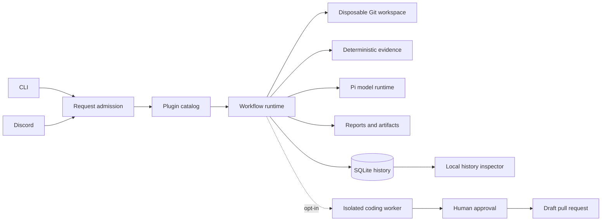

# Agent Workflow Runtime

[](https://github.com/shaversj/agent-workflow-runtime/actions/workflows/ci.yml)
[](LICENSE)

Agent Workflow Runtime is a TypeScript runtime for auditable, policy-bound AI workflows that operate on software repositories.

## The Problem

Connecting an LLM to repository tools is easy. Making the resulting work explainable, repeatable, bounded, and safe across CLI, chat, GitHub, and isolated workers is the harder engineering problem.

This project explores that runtime layer: deterministic evidence collection, typed plugin contracts, durable execution history, human approval boundaries, and disposable workspaces around model-driven interpretation and coding.

## What It Does

- Runs read-only repository readiness sweeps from a local Git checkout or Git URL.
- Discovers tools through validated plugin manifests instead of hard-coded surface commands.
- Accepts natural-language requests through CLI and Discord surfaces.
- Records interactions, tool calls, model usage, delivery state, and reports in SQLite.
- Provides a local TanStack Start history inspector for prior runs and artifacts.
- Supports opt-in coding proposals inside constrained Docker workers, with explicit human approval before creating a draft pull request.

## Architecture



Plugins own domain tools, skills, and policy metadata. Surfaces expose an allowed subset of plugin sources. Workflows coordinate validated inputs, disposable workspaces, model calls, persistence, and delivery.

## Quick Demonstration

Requirements: Node.js 24+, pnpm, Git, and a MiniMax API key for model-backed interpretation.

```bash
make install

# Add MINIMAX_API_KEY to ~/.agent-ops-kit/.env, then run:
make sweep REPO=https://github.com/example/example-repository REF=main

# Inspect saved interactions and reports:
make web
```

Open `http://127.0.0.1:3000` after starting the inspector.


A sweep produces a Markdown report and a durable history record. The target is cloned into a managed, disposable workspace; repository scripts are not executed during evidence collection.

## What This Project Demonstrates

- **Typed runtime contracts:** TypeBox validation at CLI, environment, database, plugin, tool, and model boundaries.
- **Plugin-scale tool discovery:** source-level plugin selection with searchable, policy-aware tool metadata.
- **Deterministic plus interpretive workflows:** bounded evidence gathering followed by LLM interpretation.
- **Auditable execution:** structured Pino logs and normalized SQLite records for requests, activities, usage, artifacts, and delivery.
- **Repository isolation:** managed Git mirrors, short-lived workspace leases, and read-only collection.
- **Approval-bound coding:** offline Docker execution, proposal sealing, principal-bound confirmation, and draft-PR-only publication.
- **Multiple surfaces, one runtime:** CLI, Discord, and a local browser inspector share contracts and history.

## Common Commands

```bash
make sweep REPO=https://github.com/example/example-repository REF=main
make discord
make web

agent-ops runs list
agent-ops runs show <run-id>
agent-ops reports latest
agent-ops history list --limit 20

make check
pnpm test:web
```

The `agent-ops` CLI name, `AGENT_OPS_*` environment variables, and `~/.agent-ops-kit` state directory are stable compatibility identifiers retained from the project's former name.

## Safety Model

Read-only workflows never execute repository code. They resolve targets to disposable workspaces, gather bounded evidence, sanitize target identities, and remove the workspace after use.

Coding is disabled by default and is a separate capability. It requires operator-owned configuration, a trusted digest-pinned image, an allowlisted principal and repository profile, bounded offline worker execution, successful verification, and an explicit human approval step. Publication can create only a new branch and draft pull request; it cannot force-push, merge, or deploy.

This is a local, single-operator proof of concept, not a hardened multi-tenant service.

## Documentation

- [Discord setup and commands](docs/discord.md)
- [Coding workflow and containment](docs/coding.md)
- [History inspector and runtime state](docs/history-inspector.md)
- [Live coding validation](docs/coding-live-validation.md)
- [Engineering standards](docs/standards/README.md)
- [Contributing](CONTRIBUTING.md)
- [Security policy](SECURITY.md)

## Project Shape

```text
src/
  db/          Drizzle schema and local SQLite persistence
  harness/     model runtime, execution contracts, progress, and usage
  plugins/     domain manifests, tools, evidence recipes, and skills
  surfaces/    CLI, Discord, and local TanStack Start inspection
  tools/       TypeBox tool contracts, registry, and catalog bridge
  workspaces/  target normalization, Git mirrors, and workspace leases
  workflows/   orchestration for sweeps, chat routing, and coding
```

## Development

```bash
make format
make lint
make test
make typecheck
make deadcode
make check
pnpm exec playwright install chromium
pnpm test:web
```

## License

Agent Workflow Runtime is available under the [MIT License](LICENSE).
