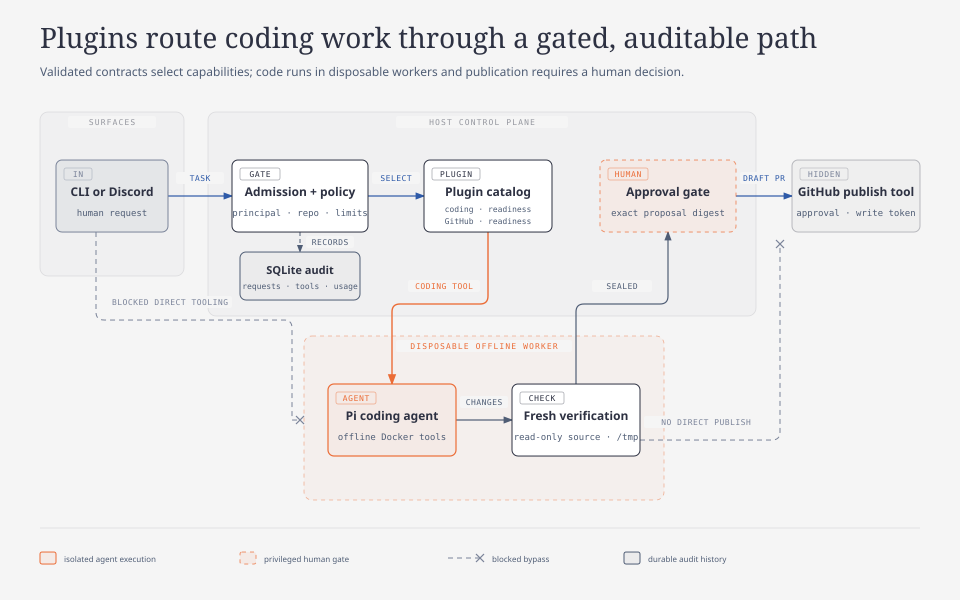
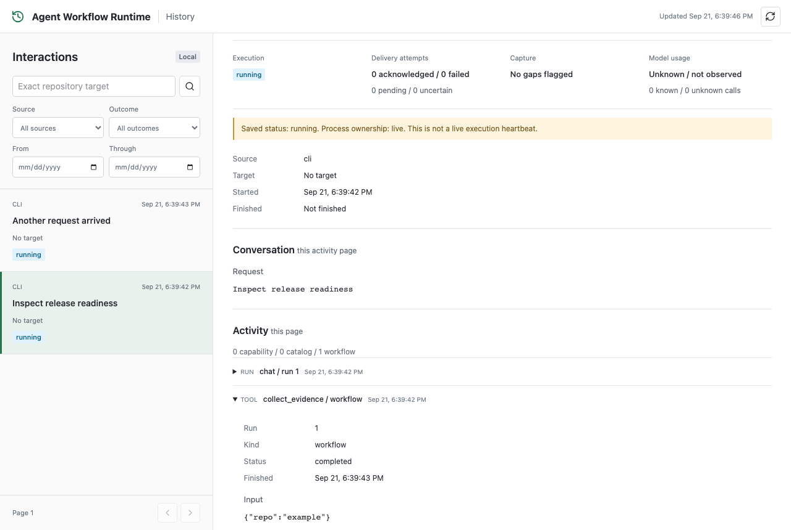

# Agent Workflow Runtime

[](https://github.com/shaversj/agent-workflow-runtime/actions/workflows/ci.yml)
[](LICENSE)

Agent Workflow Runtime is a TypeScript runtime for auditable coding agents and repository workflows. It turns a human task into an isolated code change, verifies the result, preserves a reviewable proposal, and requires explicit approval before publishing a draft pull request.

## The Problem

Connecting an LLM to repository tools is easy. Letting a coding agent edit real source while keeping execution isolated, publication human-controlled, and every step inspectable is the harder engineering problem.

This project builds that runtime layer: typed plugin contracts, disposable workspaces, offline coding workers, fresh verification, sealed proposals, durable execution history, and human approval boundaries. The same foundation also supports read-only repository intelligence and readiness sweeps.

## What It Does

- Runs Pi coding-agent sessions inside constrained, offline Docker workers.
- Pins repository source and verifies proposed changes in a separate fresh worker.
- Seals the exact proposal and requires a principal-bound human approval before publication.
- Publishes only a new branch and draft pull request; it cannot force-push, merge, or deploy.
- Discovers tools through validated plugin manifests instead of hard-coded surface commands.
- Accepts natural-language requests through CLI and Discord surfaces.
- Records interactions, tool calls, model usage, delivery state, and reports in SQLite.
- Provides a local TanStack Start history inspector for prior runs and artifacts.
- Runs read-only repository readiness sweeps from a local Git checkout or Git URL.

## Architecture



The supported path is intentionally narrow: authenticated requests pass policy admission, repository code enters a disposable offline worker, verification runs against sealed source, and only a human-approved digest can reach a new GitHub draft pull request. Direct tooling and direct publication bypasses stop at the trust boundary. SQLite records the accepted interaction and runtime activity independently of delivery.

Plugins own domain tools, skills, and policy metadata. Surfaces expose an allowed subset of plugin sources. Workflows coordinate validated inputs, disposable workspaces, model calls, persistence, and delivery.

## Plugin Model

Plugins are TypeBox-validated capability bundles. Each manifest declares what the plugin can do, what authority it needs, where its tools may appear, and whether human approval is required. CLI and Discord surfaces enable plugin sources; the runtime presents a small searchable catalog to the model and resolves the selected tool behind that boundary.

| Plugin               | Responsibility                                                         | Authority                                                                  |
| -------------------- | ---------------------------------------------------------------------- | -------------------------------------------------------------------------- |
| `coding`             | Prepare an isolated, verified change proposal with the Pi coding agent | Repository write access inside a disposable worker; never publishes        |
| `github-publication` | Publish an approved proposal to a new branch and draft pull request    | Separate write credential plus approval bound to the exact proposal digest |
| `readiness`          | Gather repository evidence, interpret readiness, and inspect reports   | Read-only target access; writes managed reports and history                |
| `github`             | Read repository, pull request, issue, release, and Actions context     | Read-only GitHub access                                                    |

This split keeps capability discovery separate from execution authority. Adding a plugin does not automatically expose its tools to every surface, and preparing code does not grant permission to publish it.

## Coding Agent Workflow

1. **Prepare:** a CLI or Discord request selects an operator-allowed repository and pins its base commit.
2. **Execute:** Pi edits the checkout through bounded tools inside an offline, non-root Docker worker.
3. **Verify:** required checks run in a fresh worker against immutable source plus the proposed change set.
4. **Review:** the runtime stores an exact private proposal, records model and tool activity, and exposes a sealed digest for inspection.
5. **Approve and publish:** the initiating human approves that exact digest; the runtime may then create a new branch and draft pull request.

Coding is disabled by default. Enabling it requires a trusted digest-pinned image, an operator-owned repository profile, allowlisted principals, scoped GitHub credentials, and Docker. See [Coding workflow and containment](docs/coding.md) for the complete setup and threat boundaries.

```bash
pnpm exec tsx src/cli.ts code prepare example/example-repository main "Fix the cart calculation"
pnpm exec tsx src/cli.ts code show <job-id>
pnpm exec tsx src/cli.ts code approve <job-id> --digest <64-hex-digest>
```

## Read-Only Sweep Demo

Requirements: Node.js 24+, pnpm, Git, and a MiniMax API key for model-backed interpretation.

```bash
make install

# Add MINIMAX_API_KEY to ~/.agent-ops-kit/.env, then run:
make sweep REPO=https://github.com/example/example-repository REF=main

# Inspect saved interactions and reports:
make web
```

Open `http://127.0.0.1:3000` after starting the inspector.



A sweep produces a Markdown report and a durable history record. The target is cloned into a managed, disposable workspace; repository scripts are not executed during evidence collection.

## What This Project Demonstrates

- **Typed runtime contracts:** TypeBox validation at CLI, environment, database, plugin, tool, and model boundaries.
- **Plugin-scale tool discovery:** source-level plugin selection with searchable, policy-aware tool metadata.
- **Deterministic plus interpretive workflows:** bounded evidence gathering followed by LLM interpretation.
- **Auditable execution:** structured Pino logs and normalized SQLite records for requests, activities, usage, artifacts, and delivery.
- **Repository isolation:** managed Git mirrors, short-lived workspace leases, and read-only collection.
- **Approval-bound coding:** offline Docker execution, proposal sealing, principal-bound confirmation, and draft-PR-only publication.
- **Multiple surfaces, one runtime:** CLI, Discord, and a local browser inspector share contracts and history.

## Common Commands

```bash
make sweep REPO=https://github.com/example/example-repository REF=main
make discord
make web

agent-ops runs list
agent-ops runs show <run-id>
agent-ops reports latest
agent-ops history list --limit 20

make check
pnpm test:web
```

The `agent-ops` CLI name, `AGENT_OPS_*` environment variables, and `~/.agent-ops-kit` state directory are stable compatibility identifiers retained from the project's former name.

## Safety Model

Read-only workflows never execute repository code. They resolve targets to disposable workspaces, gather bounded evidence, sanitize target identities, and remove the workspace after use.

Coding is disabled by default and is a separate capability. It requires operator-owned configuration, a trusted digest-pinned image, an allowlisted principal and repository profile, bounded offline worker execution, successful verification, and an explicit human approval step. Publication can create only a new branch and draft pull request; it cannot force-push, merge, or deploy.

This is a local, single-operator proof of concept, not a hardened multi-tenant service.

## Documentation

- [Discord setup and commands](docs/discord.md)
- [Coding workflow and containment](docs/coding.md)
- [History inspector and runtime state](docs/history-inspector.md)
- [Live coding validation](docs/coding-live-validation.md)
- [Engineering standards](docs/standards/README.md)
- [Contributing](CONTRIBUTING.md)
- [Security policy](SECURITY.md)

## Project Shape

```text
src/
  db/          Drizzle schema and local SQLite persistence
  harness/     model runtime, execution contracts, progress, and usage
  plugins/     domain manifests, tools, evidence recipes, and skills
  surfaces/    CLI, Discord, and local TanStack Start inspection
  tools/       TypeBox tool contracts, registry, and catalog bridge
  workspaces/  target normalization, Git mirrors, and workspace leases
  workflows/   orchestration for sweeps, chat routing, and coding
```

## Development

```bash
make format
make lint
make test
make typecheck
make deadcode
make check
pnpm exec playwright install chromium
pnpm test:web
```

## License

Agent Workflow Runtime is available under the [MIT License](LICENSE).
